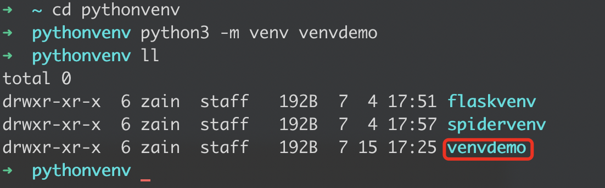
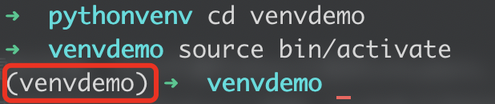
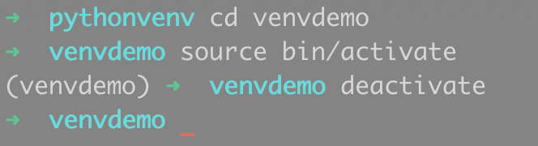

# python虚拟环境


## 一.python venv简介

Python3.3以上的版本通过venv模块原生支持虚拟环境，可以代替Python之前的virtualenv。


## 二.python venv使用

### 1. python venv的创建

在命令行中输入

```shell
python3 -m venv <虚拟环境名>
```

在当前目录创建一个虚拟环境



### 2.python venv的激活

在命令行中进入刚刚创建的虚拟环境文件夹

然后激活该文件夹下bin/activate即可

```shell
cd <虚拟环境名>
source bin/activate
```

windows则是在命令行进入该虚拟环境文件夹后直接在命令行输入以下命令来激活

```
activate.bat
```

命令行会出现`(<虚拟环境名>)`,提示已经激活该虚拟环境



### 3.python venv的退出

进入虚拟环境后,直接在命令行中输入以下命令来退出该虚拟环境

```
deactivate
```

可以看到命令行中`(<虚拟环境名>)`已经消失,代表已经退出该虚拟环境




## 三.python venv的迁移
有时候基于虚拟环境的项目,上传到github之后,由于别人没有配置相同的虚拟环境所以无法正常启动,这时候我们可以导出自己当前虚拟环境的配置信息,一起上传至github,别人可以通过这些配置信息搭建一个相同的虚拟环境
### 1.导出
进入虚拟环境后,在命令行输入以下命令导入当前虚拟环境的配置信息
```
pip freeze --all > requirements.txt
```
这时会在当前目录生成一个`requirements.txt`,里面记录了pip包信息

### 2.导入
新建好一个虚拟环境后,将`requirements.txt`复制到该虚拟环境文件夹中  

激活该虚拟环境后,在命令行中进入该虚拟环境文件夹,输入以下命令自动安装所需pip包
```
pip install -r requirements.txt
```
这时通过以下命令查看该虚拟环境是否已经安装完所需pip包
```
pip list
```