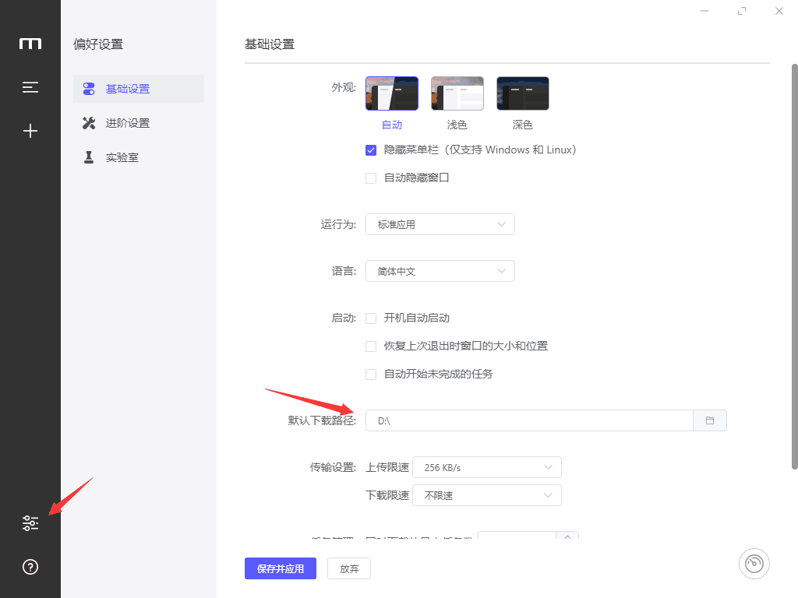
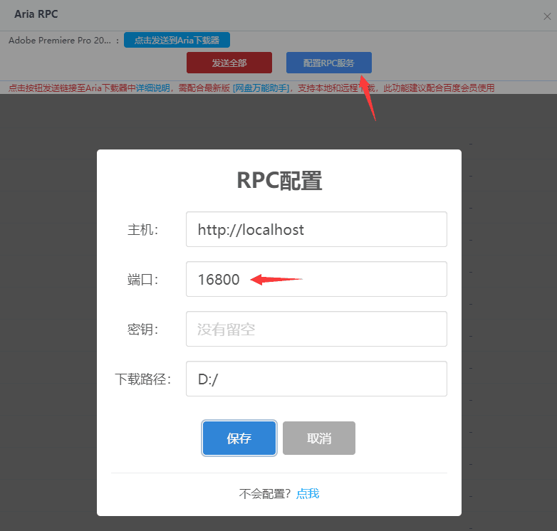
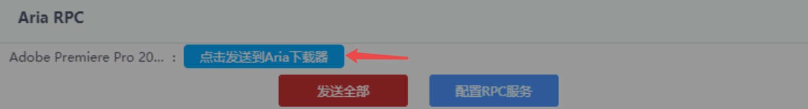
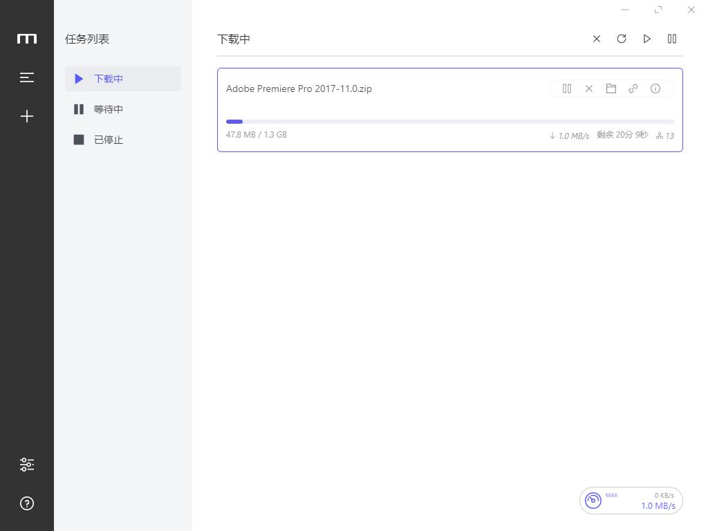

# 百度网盘不限速下载方法

## 1.安装准备

### 1.1 安装 脚本管理器"Tampermonkey"

- 从[Tampermonkey官网](http://www.tampermonkey.net/),下载crx文件(需科学上网)

- 百度搜索`tampermonkey`,下载crx文件

直接使用chrom安装crx可能提示**该程序包无效**,这里介绍另外一种安装方式:

将下载得到的crx文件用解压缩文件打开,并解压得到`Tampermonkey_extension_x_x_x_x`文件夹(x为版本号).

> 点击chrome右上角三个点
>
> > 更多工具
> >
> > > 拓展程序
> > >
> > > > 左上角的`加载已解压的拓展程序`
> > > >
> > > > > 选择刚刚解压得到的文件夹
> > > > >
> > > > > > 安装成功.

### 1.2 安装 脚本"网盘直链下载助手"

[点击安装该脚本](https://www.baiduyun.wiki/baiduyun.user.js)

### 1.3 安装 插件"网盘万能助手"

[点击安装该插件](https://www.lanzoux.com/b00t6r2id)    (密码:**3mys**)

下载.zip或者.crx文件皆可,因为crx安装可能无法直接安装,要和.zip文件一样解压出来安装.

下载完按照安装`Tampermonkey`的方法安装该插件.

### 1.4 安装 下载器 "motrix"

[点击安装该下载器](https://www.motrix.app/)

下载完成后安装`motrix`

## 2.使用教程

### 2.1设置下载路径

安装完`motrix`后打开,并设置好想要的下载路径,点击**保存并应用**

### 2.2百度网盘网页端配置

打开百度网盘选择要下载的文件然后点击上方出现的**下载助手**,点击**显示链接**

点击后,再点击**配置RPC服务**   (**端口号:16800**,注意**下载路径**要和**2.1**所设置的一致),点击**保存**

### 2.3开始下载
点击**发送到Aria下载器**

这时候切回`motrix`查看下载进度吧(决定下载速度的因素很多,但是比百度网盘客户端下载快得多,这里以我自己的Pr为例)

下载速度有 ***1MB/S***

