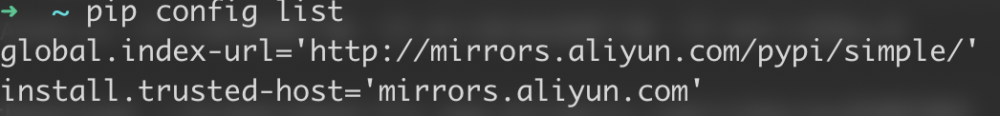
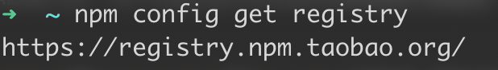

# pip,npm,homebrew更换国内镜像源
相信装了pip,npm,homebrew的小伙伴们在使用他们的时候都会有一个共同的问题,***太慢了!!!***
其实可以通过更换他们的源为国内镜像源来达到飞速下载的效果.
## pip换源
在命令行中输入以下命令创建`.pip`文件夹.并创建`pip.conf`文件
```
cd ~ 
mkdir .pip
touch pip.conf
```
然后在访达中按`shift+cmd+g`输入`~/.pip`进入`.pip`文件夹,用文本编辑器打开'pip.conf`文件
在其中输入以下内容后保存退出
```
[global]
index-url = http://mirrors.aliyun.com/pypi/simple/
[install]
trusted-host=mirrors.aliyun.com
```
在命令行中输入以下命令检查更换是否生效
```
pip config list
```




## npm换源
npm可以将官方源更换为国内阿里的镜像源
在命令行输入以下代码来更换阿里镜像源
```
npm config set registry https://registry.npm.taobao.org
```
通过以下命令检查更改是否成功
```
npm config get registry
```

## homebrew换源