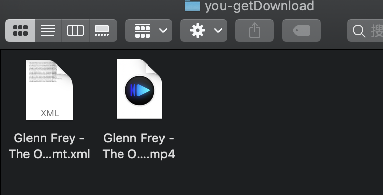

# 网页视频下载
有时候想下载网页里的视频,但是网页并没有提供下载功能怎么办呢?
这里给大家推荐命令行程序**you-get**(用命令行下载网页视频.怎么样?是不是很高大上?)


## 1.安装
### 1.1 pip
pip是一个Python包安装与管理工具

你可以通过在终端输入以下命令来判断是否已安装:

```
pip --version
```
如果你的电脑里已经安装了**pip** ***请跳过该节***

如果你的电脑里已经安装了**pip** ***请跳过该节***

如果你的电脑里已经安装了**pip** ***请跳过该节***


- 如果你的电脑里安装了python,请在终端输入下方命令:
```
 curl https://bootstrap.pypa.io/get-pip.py -o get-pip.py   # 下载安装脚本
 sudo python get-pip.py    # 运行安装脚本
```

- 如果你的电脑没有安装python,请安装python,python3及以上会自带pip,请[点击进入python官网](https://www.python.org),**Download**并点击下方**Latest**右边的最新版**python**,在**Download**页面下方的**Files**中找到对应操作系统的python安装包

  (Windows系统推荐 executablr installer,打开后只需点击Install now即可,记住请勾选**Add Python 3.x  to PATH**)


### 1.2 you-get

you-get就是今天的主角了,通过它来下载网页中视频.

通过在终端输入以下命令来安装**you-get**

```
 pip3 install you-get
```

***如果安装过慢(pip默认源在国外)可以参考我的另一篇文章,更换pip为国内镜像源,下载速度显著提高)***

***如果安装过慢(pip默认源在国外)可以参考我的另一篇文章,更换pip为国内镜像源,下载速度显著提高)***

***如果安装过慢(pip默认源在国外)可以参考我的另一篇文章,更换pip为国内镜像源,下载速度显著提高)***

通过以下命令来判断是否安装成功:

```
 you-get --version
```


## 2.使用

### 2.1下载网页视频(默认配置):
默认下载到 **~/Documents**

下载的**视频格式**也是**网页默认**的,可以通过**2.2**查看

如果是多P视频,则默认下载**第1P**视频

```
you-get <网址URL>
```

### 2.2查看当前网页视频信息:

```zsh
you-get -i <网址URL>  #参数“i”代表“infomation”，查看视频的信息包括：格式、画质、大小等
```

### 2.3下载到选择的下载路径:

```zsh
you-get -o <下载路径> <网址URL> #参数"o"代表"output",后面跟上下载路径和网址URL
```

### 2.4下载选定格式的视频(通过2.1查看):

```
you-get --format=<视频格式> <网址url>
```

### 2.5下载多个视频

类似B站一个网页可能有多P视频,加上`-l`可以下载全部视频

```
you-get -l <网址URL> #参数"l"代表"playlist",后面跟上网址URL
```

## 3.例:B站视频下载


```
you-get -o ~/you-getDownload --format=dash-flv https://www.bilibili.com/video/BV1Mb411i747
```




